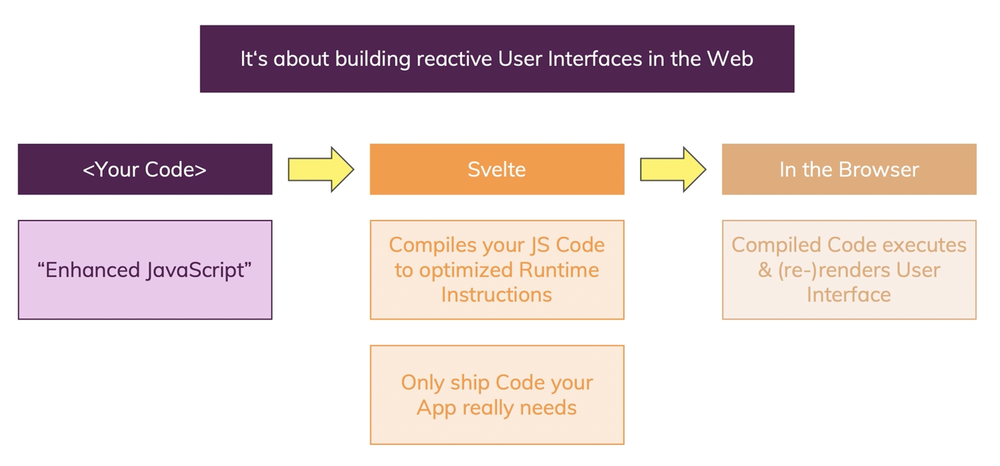

### Input HTML inside <div></div> tags

- User can enter html code
- (not recommended) encourages Cross-Site Scripting attacks (XSS).

```
  <div class="description">
    <p>{@html description}</p>
  </div>
```

### Styling a class conditionally (ternary operator)

- 2 Methods:

```
    <div class="{userImage ? 'thumb' : 'thumb thumb-placeholder'}">
      
    </div>
```

```
    <div class="thumb" class:thumb-placeholder="{!userImage}">
      
    </div>
```

### Disable Cors

- Mac

```
open -n -a /Applications/Google\ Chrome.app/Contents/MacOS/Google\ Chrome --args --user-data-dir="/tmp/chrome_dev_test" --disable-web-security
```

- Windows

```
C:\Program Files (x86)\Google\Chrome\Application\chrome.exe" --disable-web-security --disable-gpu --user-data-dir=~/chromeTemp
```

### Check Chrome Version

`chrome://version`

## Svelte dev server stuck on an old version

- Open Dev Tools -> Network Tab --> Disable cache

## What is Svelte

- Svelte is a Compiler, not a Framework (React, Vue, Angular).
- Translates instructions into efficient runtime code at build time.

### How does Svelte work?



## Two Directional Flow

- `value` data flow into the input
- `on:input` data flow out of the input

```
<input type="text" value="{name}" on:input="{nameInput}" >
```

### If statements

```svelte
{#if formState === "done"}
<ContactCard userName={name} jobTitle={title} {description} userImage={image} />
{/if}
{#if formState === "invalid"}
<p>Invalid Input</p>
{/if}
```

### else if

```svelte
{#if formState === "done"}
<ContactCard userName={name} jobTitle={title} {description} userImage={image} />
{:else if formState === "invalid"}
<p>Invalid Input</p>
{/if}
```

### each

- `createdContacts` is an array
- The code below adds the latest javascript object into the last element of the new array `createdContacts`

```svelte
    createdContacts = [...createdContacts,
    {
      name: name,
      jobTitle: title,
      imageURL: image,
      desc: description
    }
  ];
```

```svelte
{#each createdContacts as contact}
<ContactCard
userName={contact.name}
jobTitle={contact.jobTitle}
description={contact.description}
userImage={contact.imageURL} />
{/each}
```

### Adding an index in `each`

```svelte
{#each createdContacts as contact, index}
<h2># {index + 1}</h2>
<ContactCard
userName={contact.name}
jobTitle={contact.jobTitle}
description={contact.desc}
userImage={contact.imageURL} />
{:else}
  <p>Please start adding some contacts, we found none!</p>
{/each}
```

### Deleting cards

```svelte
  function deleteFirst() {
    createdContacts = createdContacts.slice(1)
  }

  function deleteLast() {
    createdContacts = createdContacts.slice(0, -1)
  }
```

### Adding an id to `each`

```svelte
<script>
        createdContacts = [...createdContacts,
    {
      id: Math.random(),
      name: name,
      jobTitle: title,
      imageURL: image,
      desc: description
    }
</script>

{#each createdContacts as contact, index (contact.id)}
<h2># {index + 1}</h2>
<ContactCard
userName={contact.name}
jobTitle={contact.jobTitle}
description={contact.desc}
userImage={contact.imageURL} />
{:else}
  <p>Please start adding some contacts, we found none!</p>
{/each}
```

### Reacting to clicks on items

- `on:click="{() => clickHandlerFunc(yourArgument)}"`
- `on:click="{() => clickHandlerFunc.bind(this, yourArgument)}"`

```svelte
  <ul>
	{#each passwords as pw, i}
	  <li on:click={removePassword.bind(this, i)}>{pw}</li>
	{/each}
  </ul>
```

- To remove an item from a list, can use the `filter()` method on the existing array to filter out (=remove) an element with a specific index.
  - `filter(function(element, index, array))`
  - `index` is the index of the current element being processed in the array.

```svelte
	function removePassword(index) {
	  passwords = passwords.filter((pw, idx) => {
		return idx !== index;
	  });
	}
```

- adding an index in the `each` statement increases the performance.

### Event Identifier

- only allow the button to be used once
- `<button on:click|once={addContact} >Add Contact Card</button>`

- `<button on:click|stopPropagation={addContact} >Add Contact Card</button>`

- `<button on:click|preventDefault={addContact} >Add Contact Card</button>`
  - used in "forms"
  - prevent browser default refresh

### Inline functions

```svelte
<button on:click="{(event) => {createdContacts = createdContacts.slice()}}">Delete First</button>
```

## Component Types

- Stateful components, containers

  - Hold & manage data, pass data around
  - <App>, <Products>, <Checkout>
  - Only a few

- Presentational Components
  - Receive & Output data
  - <Modal>, <Card>, <Button>
  - Many
